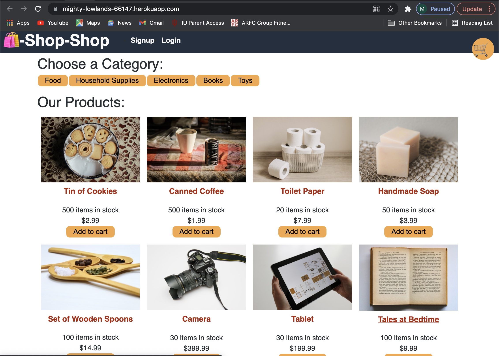

# mjl_reduxstore

This project is an e-commerce platform that uses Redux, Apollo, React, JWT, Graphql, and stripe. It is deployed on Heroku:

  [https://mighty-lowlands-66147.herokuapp.com/](https://mighty-lowlands-66147.herokuapp.com/)

  See [User Story](#user-story) below for more information.

## Contents

&nbsp;&nbsp;&nbsp;&nbsp;&nbsp;[User Story](#user-story)<br/>
&nbsp;&nbsp;&nbsp;&nbsp;&nbsp;[Acceptance Criteria](#acceptance-criteria)<br/>
&nbsp;&nbsp;&nbsp;&nbsp;&nbsp;[Installation](#installation)<br/>
&nbsp;&nbsp;&nbsp;&nbsp;&nbsp;[Usage](#usage)<br/>
&nbsp;&nbsp;&nbsp;&nbsp;&nbsp;[Contributing](#contributing)<br/>
&nbsp;&nbsp;&nbsp;&nbsp;&nbsp;[Questions](#questions)<br/>
&nbsp;&nbsp;&nbsp;&nbsp;&nbsp;[Screenshot](#screenshot)<br/>

## User Story

```md
AS a senior engineer working on an e-commerce platform
I WANT my platform to use Redux to manage global state instead of the Context API
SO THAT my website's state management is taken out of the React ecosystem
```

## Acceptance Criteria

```md
GIVEN an e-commerce platform that uses Redux to manage global state
WHEN I review the app’s store
THEN I find that the app uses a Redux store instead of the Context API
WHEN I review the way the React front end accesses the store
THEN I find that the app uses a Redux provider
WHEN I review the way the app determines changes to its global state
THEN I find that the app passes reducers to a Redux store instead of using the Context API
WHEN I review the way the app extracts state data from the store
THEN I find that the app uses Redux instead of the Context API
WHEN I review the way the app dispatches actions
THEN I find that the app uses Redux instead of the Context API
```
## Installation 

To install theDopeOnDev project, 

1. Clone this repository.
2. At a command prompt in the root directory for the project, run the following command, which will install the needed npm packages:
```
   npm install
```
3. Open MongooseDB on your machine. 
4. From the root directory, run
```
   npm run seed
```

## Usage 

To run enter the following at a command prompt in the root directory for the project: 
```
   npm run develop    
```

## Contributing

Outside contributions are not being accepted since this project is for educational purposes. 

## Questions

Send questions to mjlinder218@gmail.com. 
For more information about the developer, see https://github.com/mlin901.

## Screenshot

